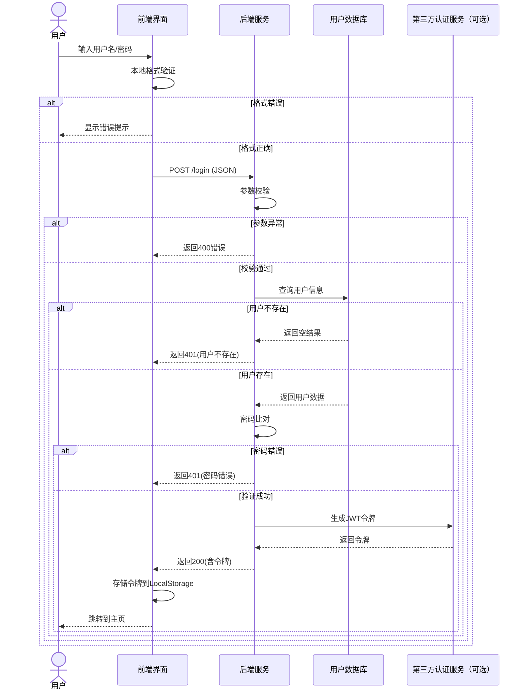

```mermaid
sequenceDiagram
    actor 用户 as 用户
    participant 前端 as 前端界面
    participant 后端 as 后端服务
    participant 数据库 as 用户数据库
    participant 认证服务 as 第三方认证服务（可选）

    用户 ->> 前端: 输入用户名/密码
    前端 ->> 前端: 本地格式验证
    alt 格式错误
        前端 -->> 用户: 显示错误提示
    else 格式正确
        前端 ->> 后端: POST /login (JSON)
        后端 ->> 后端: 参数校验
        alt 参数异常
            后端 -->> 前端: 返回400错误
        else 校验通过
            后端 ->> 数据库: 查询用户信息
            alt 用户不存在
                数据库 -->> 后端: 返回空结果
                后端 -->> 前端: 返回401(用户不存在)
            else 用户存在
                数据库 -->> 后端: 返回用户数据
                后端 ->> 后端: 密码比对
                alt 密码错误
                    后端 -->> 前端: 返回401(密码错误)
                else 验证成功
                    后端 ->> 认证服务: 生成JWT令牌
                    认证服务 -->> 后端: 返回令牌
                    后端 -->> 前端: 返回200(含令牌)
                    前端 ->> 前端: 存储令牌到LocalStorage
                    前端 -->> 用户: 跳转到主页
                end
            end
        end
    end
```