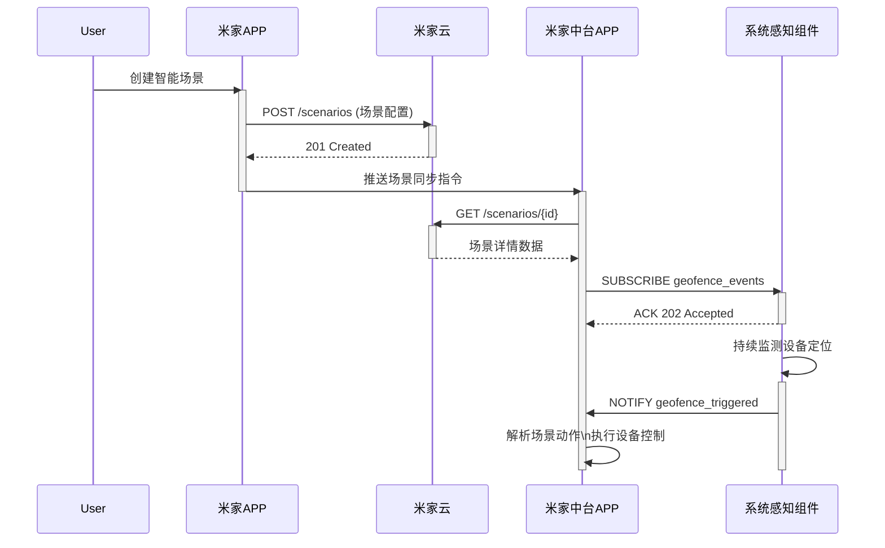

```mermaid
sequenceDiagram
    participant User
    participant 米家APP
    participant 米家云
    participant 米家中台APP
    participant 系统感知组件

    %% 场景创建流程
    User->>米家APP: 创建智能场景
    activate 米家APP
    米家APP->>米家云: POST /scenarios (场景配置)
    activate 米家云
    米家云-->>米家APP: 201 Created
    deactivate 米家云
    米家APP->>米家中台APP: 推送场景同步指令
    deactivate 米家APP

    %% 数据同步流程
    activate 米家中台APP
    米家中台APP->>米家云: GET /scenarios/{id}
    activate 米家云
    米家云-->>米家中台APP: 场景详情数据
    deactivate 米家云

    %% 围栏订阅流程
    米家中台APP->>系统感知组件: SUBSCRIBE geofence_events
    activate 系统感知组件
    系统感知组件-->>米家中台APP: ACK 202 Accepted
    deactivate 系统感知组件

    %% 围栏触发流程
    系统感知组件->>系统感知组件: 持续监测设备定位
    activate 系统感知组件
    系统感知组件->>米家中台APP: NOTIFY geofence_triggered
    米家中台APP->>米家中台APP: 解析场景动作\n执行设备控制
    deactivate 系统感知组件
    deactivate 米家中台APP
```