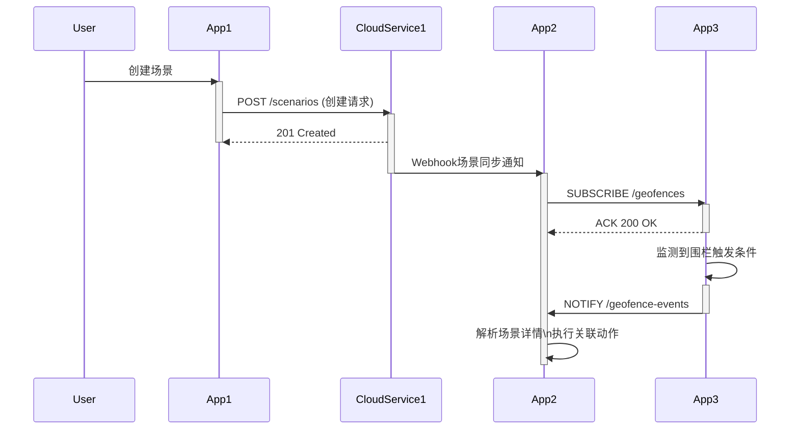

```mermaid
sequenceDiagram
    participant User
    participant App1
    participant CloudService1
    participant App2
    participant App3

    %% 创建场景流程
    User->>App1: 创建场景
    activate App1
    App1->>CloudService1: POST /scenarios (创建请求)
    activate CloudService1
    CloudService1-->>App1: 201 Created
    deactivate App1
    CloudService1->>App2: Webhook场景同步通知
    deactivate CloudService1

    %% 订阅围栏流程
    activate App2
    App2->>App3: SUBSCRIBE /geofences
    activate App3
    App3-->>App2: ACK 200 OK
    deactivate App3

    %% 围栏触发流程
    App3->>App3: 监测到围栏触发条件
    activate App3
    App3->>App2: NOTIFY /geofence-events
    deactivate App3
    App2->>App2: 解析场景详情\n执行关联动作
    deactivate App2
```