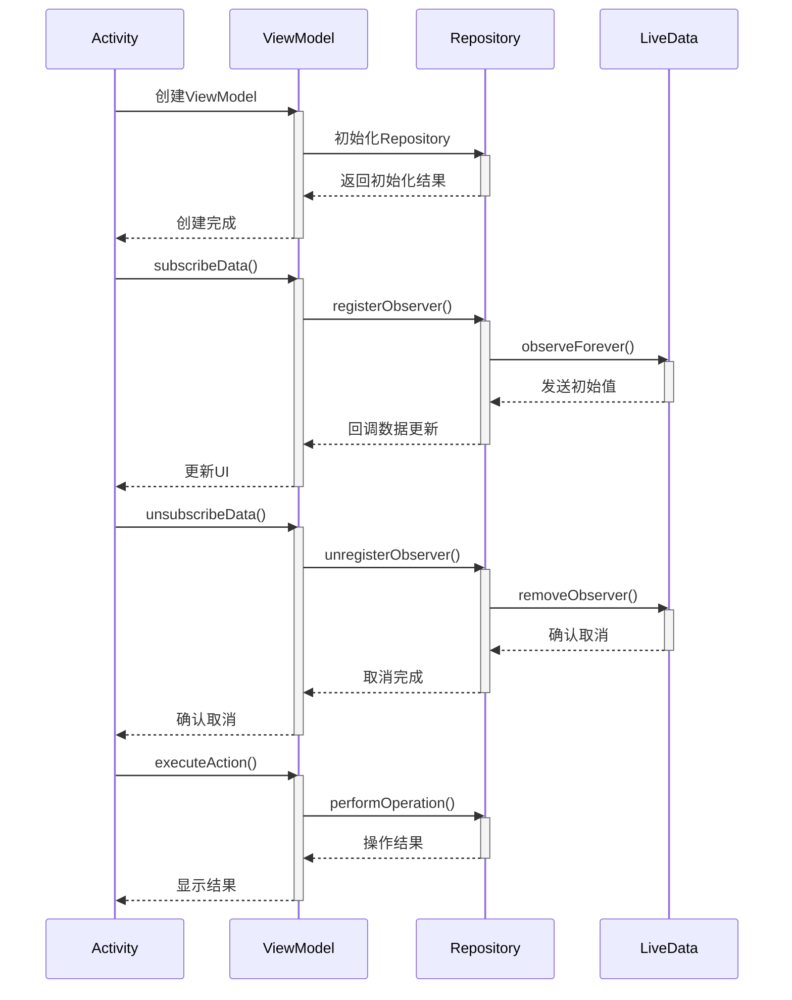

```mermaid
sequenceDiagram
    participant Activity
    participant ViewModel
    participant Repository
    participant LiveData

    %% 场景创建流程
    Activity->>ViewModel: 创建ViewModel
    activate ViewModel
    ViewModel->>Repository: 初始化Repository
    activate Repository
    Repository-->>ViewModel: 返回初始化结果
    deactivate Repository
    ViewModel-->>Activity: 创建完成
    deactivate ViewModel

    %% 订阅数据流程
    Activity->>ViewModel: subscribeData()
    activate ViewModel
    ViewModel->>Repository: registerObserver()
    activate Repository
    Repository->>LiveData: observeForever()
    activate LiveData
    LiveData-->>Repository: 发送初始值
    deactivate LiveData
    Repository-->>ViewModel: 回调数据更新
    deactivate Repository
    ViewModel-->>Activity: 更新UI
    deactivate ViewModel

    %% 取消订阅流程
    Activity->>ViewModel: unsubscribeData()
    activate ViewModel
    ViewModel->>Repository: unregisterObserver()
    activate Repository
    Repository->>LiveData: removeObserver()
    activate LiveData
    LiveData-->>Repository: 确认取消
    deactivate LiveData
    Repository-->>ViewModel: 取消完成
    deactivate Repository
    ViewModel-->>Activity: 确认取消
    deactivate ViewModel

    %% 执行操作流程
    Activity->>ViewModel: executeAction()
    activate ViewModel
    ViewModel->>Repository: performOperation()
    activate Repository
    Repository-->>ViewModel: 操作结果
    deactivate Repository
    ViewModel-->>Activity: 显示结果
    deactivate ViewModel
```